# Frontend debugger skills

本文会介绍vscode和chrome调试技巧

## 调试node程序
>[查看官方文档](https://nodejs.org/en/docs/guides/debugging-getting-started)

### node debugger模式+chrome调试

```sh
# 启动debugger
node --inspect-brk index.js

# 指定端口
node --inspect-brk=8999 index.js

# 启动debugger模式(这种方式控制台会开启debugger模式，可以在控制台输入命令)
node inspect index.js
```
通过这种方式node会以debugger模式运行，并且会在首行断住，此时，也会启动一个web socket作为debugger server，需要通过client连接这个server，就可以调试了

打开浏览器输入`chrome://inspect`，在`Devices`tab中的`Discover network targets`中配置`localhost:9229`，端口对应node的debugger server的端口就可以了，配置好后，就会发现下面`Remove Target`里会发现node的debugger server，点击`inspect`会打开新的调试窗口，就可以在浏览器中调试了，和在浏览器调试一模一样，关闭调试窗口后，会结束调试

启动：
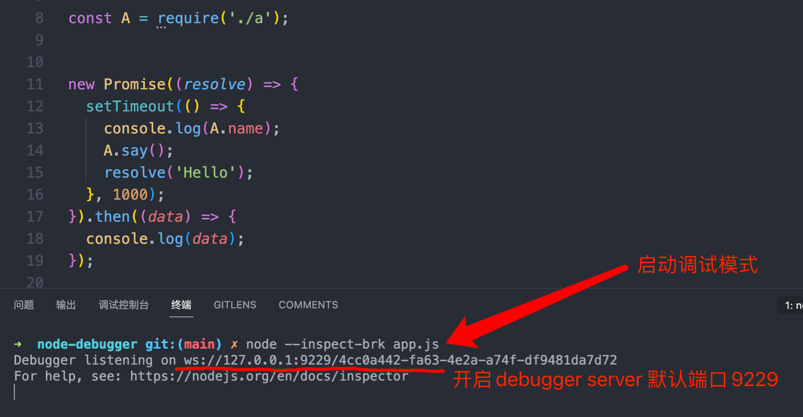

上面两种启动都会在首行断住

用Chrome DevTools连接：
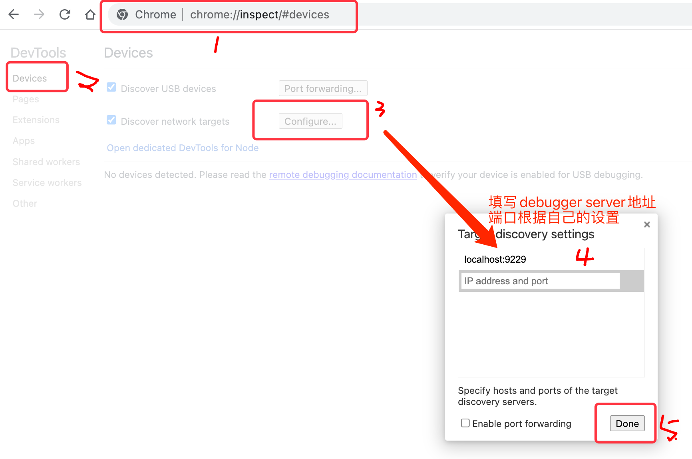
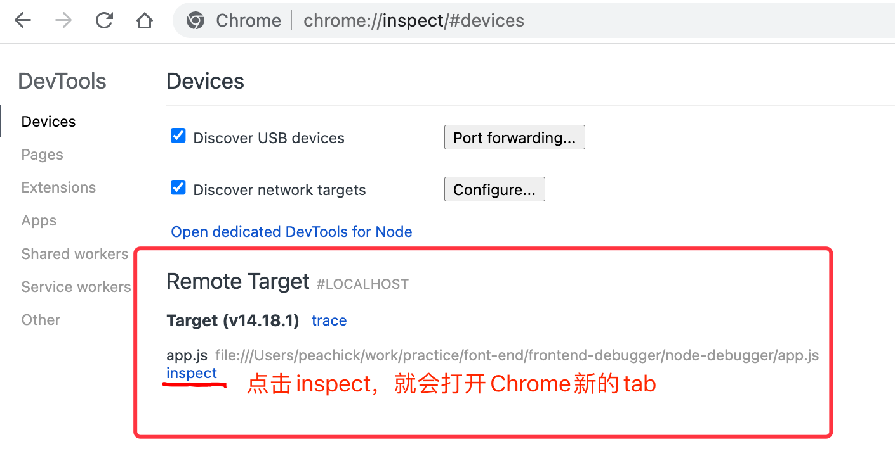
调试：
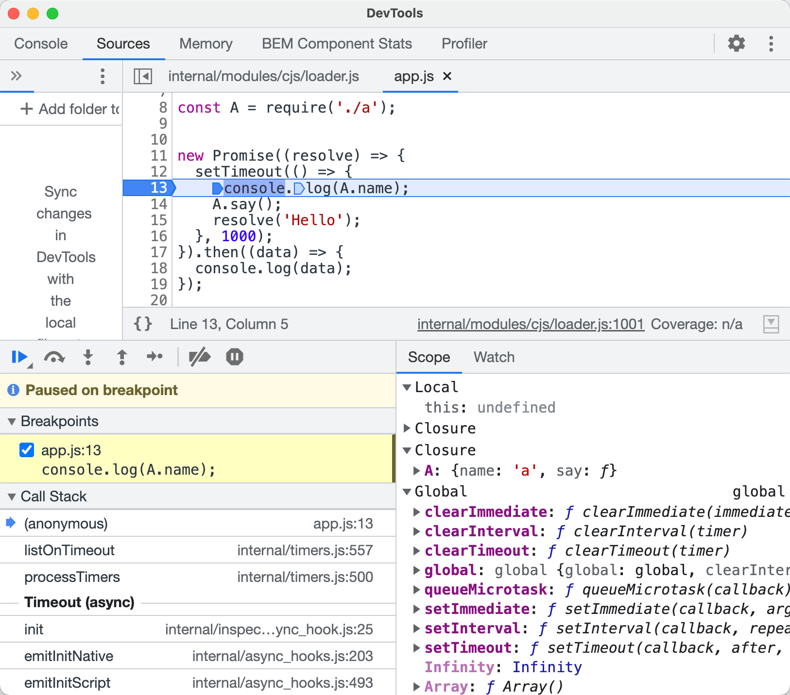

### node debugger模式+vscode调试
同上，用node debugger模式启动，会开启node debugger server，然后通过vscode连接这个server就可以调试了

那怎么用vscode连接node debugger server呢？

需要在项目中`.vscode/launch.js`文件中配置，server client，这个配置文件可以直接在工具bar`运行->添加配置`直接生成配置文件，可以在文件右下角点击`添加配置`会有对应的提示
```json
{
  // 使用 IntelliSense 了解相关属性。
  // 悬停以查看现有属性的描述。
  // 欲了解更多信息，请访问: https://go.microsoft.com/fwlink/?linkid=830387
  "version": "0.2.0",
  "configurations": [
    {
			// 以node方式调试
      "type": "node",
			// 连接方式为 连接 (attach、launch两种选项)
			// 因为只要开一个client server 连接到刚刚的node debugger server 就可以
      "request": "attach",
      "name": "Attach Debugger", // 随便起个名字
			// 跳过的文件 (可选)
      "skipFiles": ["<node_internals>/**"]
    }
  ]
}
```
配置好`client server`后，点击`vscode 左侧 debugger`选项切换成调试面板，做上面like播放键就可以看到刚刚配置的调试名字，如果有多个时，可以选择，和其他IDE调试类似，点击播放键，就开始调试了，这个就直接在vscode中调试了，调试面板中会和Chrome一样有`作用域`、`变量`、`调用堆栈`等信息，如果你熟悉Java的IDE调试这个没啥问题

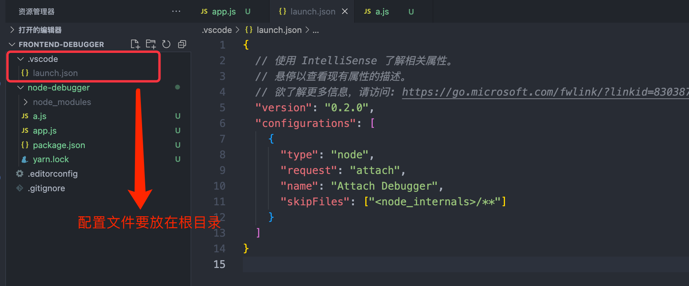
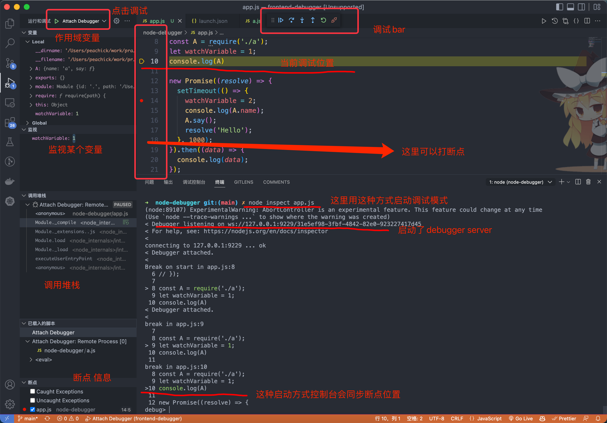

### 仅vscode调试
上面都是要在命令行启动node debugger模式开启debugger server，在启动一个server client去连接server，总体来说有点麻烦，可以用vscode将两者异步完成

和上面一样，在配置文件中再添加一个配置，将request改为`launch`，并添加`program`属性指定调试的文件即可，在js文件中左侧打个断点，这样就可以在vscode中直接调试了
```json
{
  "configurations": [
    {
      "name": "Launch Debugger",
      "program": "${workspaceFolder}/node-debugger/app.js",
      "request": "launch",
			// 会在文件首行断住
      "stopOnEntry": true,
      "skipFiles": ["<node_internals>/**"],
      "type": "node"
    },
  ]
}
```
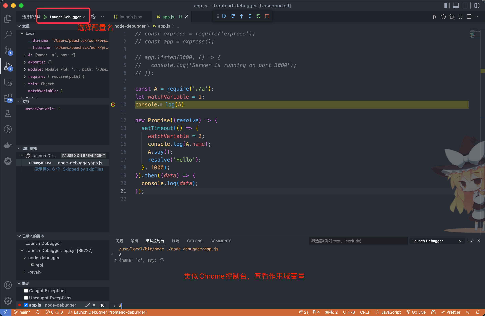

### 调试需编译的程序

## 调试网页程序


## 线上调试（异常上报+监控系统+map映射）
假如有一个场景，开发好的项目上线后，发现一个bug报错了，潜意识下会打开控制台看下哪里错了，但不幸的是，一般上线项目都会打包压缩，而且不会有soucemap，这让错误排查变得棘手。

通常情况在发布生产时，同时生成soucemap，将soucemap放到指定位置，用来和生产环境错误做映射，这样就可以在开发环境中查看错误的位置了，这样就可以更快的解决错误了，同时也能将错误记录到系统中

假如发布一个react项目如下：
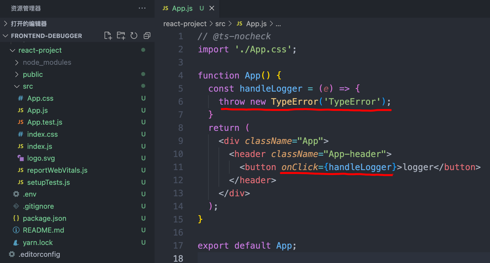
代码很简单，点击按钮手动抛出一个错误，现在发布上线，当点击按钮时就会报错
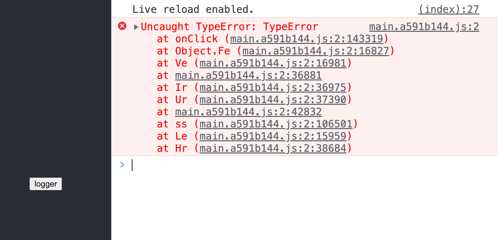
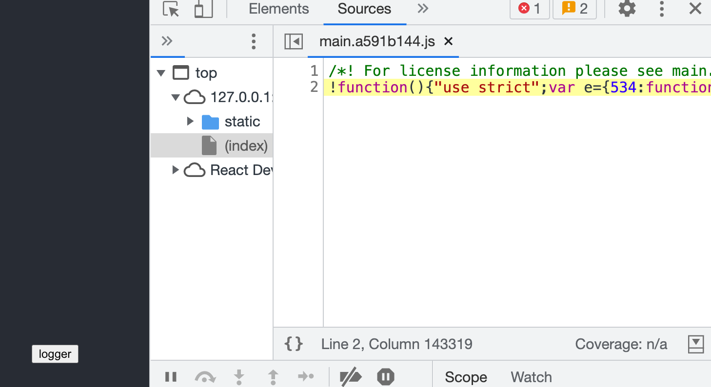
潜意识下打开控制台点击报错信息，带我们去目标文件，发现竟是打包后的，顿时懵逼，一头雾水；不嫌麻烦的同学可能会在本地重启项目排查，但不同环境数据可能不同，导致也很难排查，那为何不直接线上排查呢

通过映射线上环境的sourcemap，不就可以查找到错误位置了吗

### 手动添加

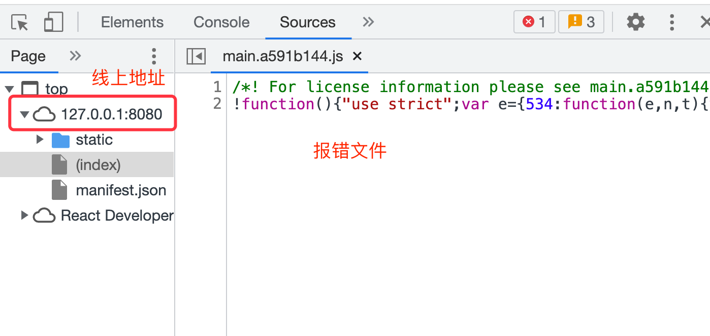
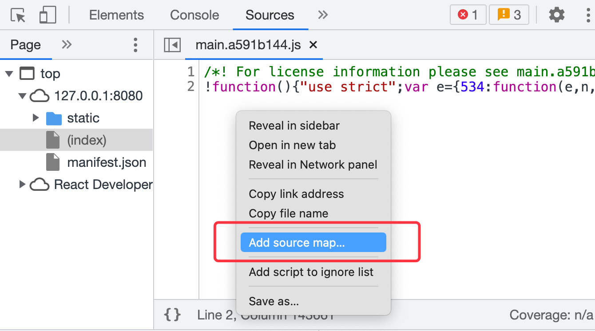
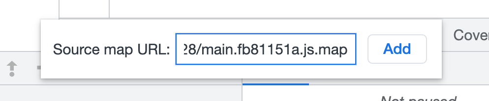
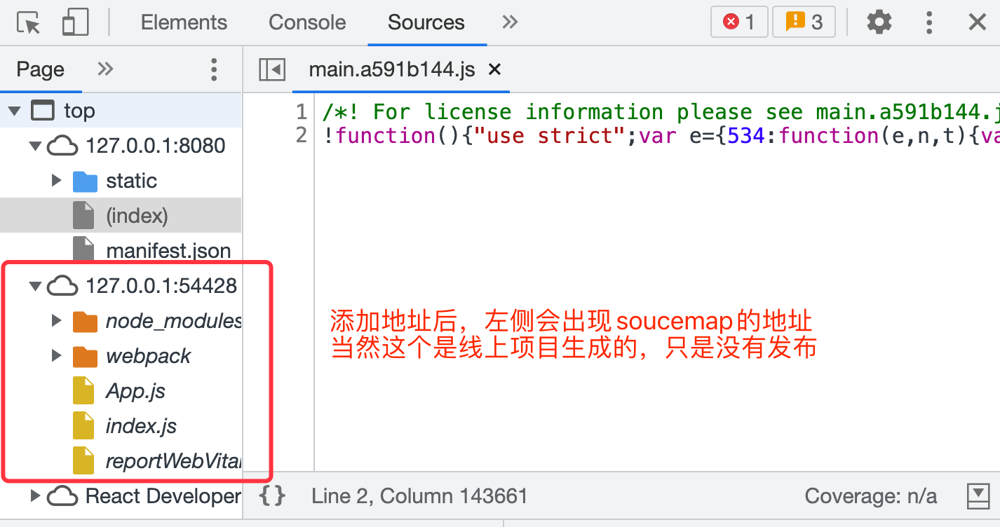
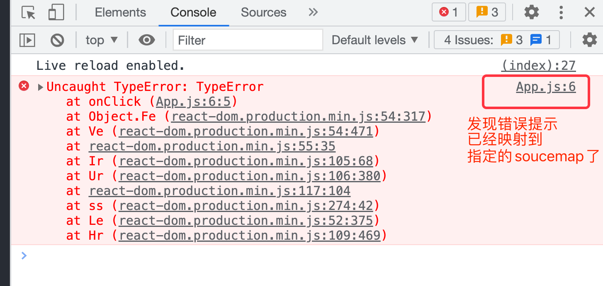
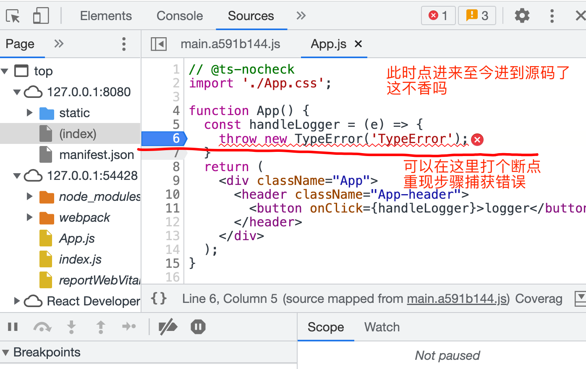
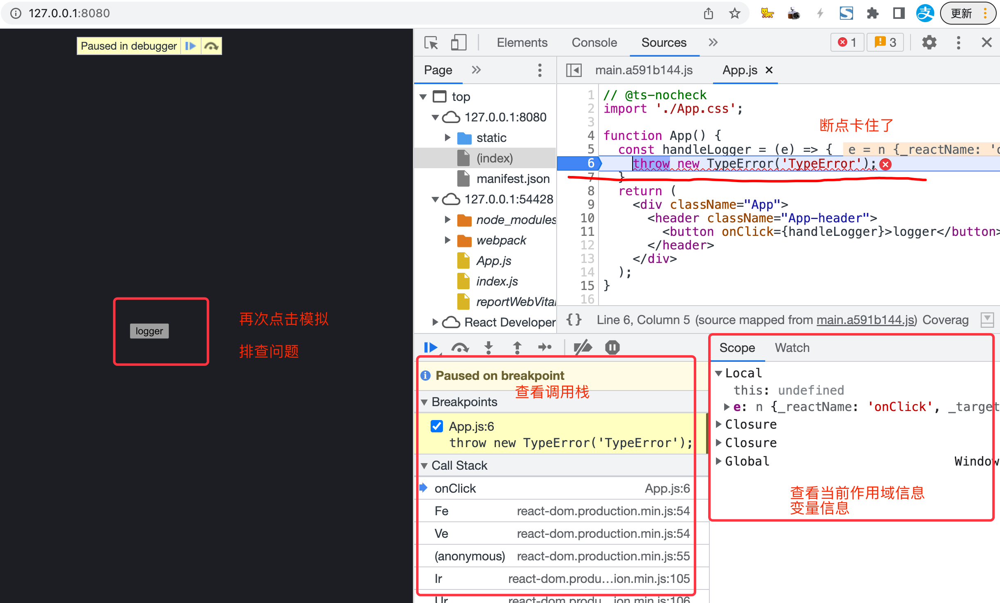
Vue项目同理
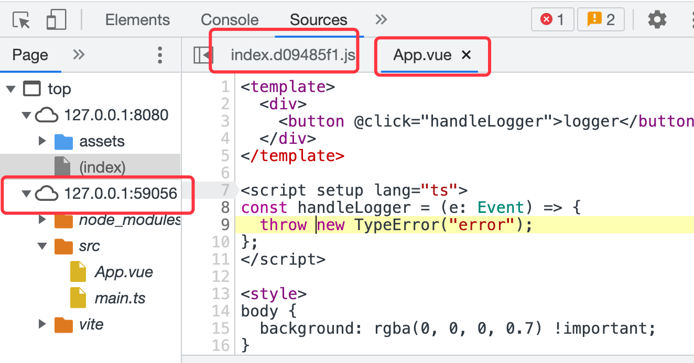

### 自动映射

`sourcemap`解密
```json
// sourcemap结构
{
	// sourcemap版本
	version: 3,
	// 转换后的文件名
	file: 'index.min.js',
	// 源文件名路径
	sources: [],
	// 源文件内容字符串（和sources一一对应）sources[0] 文件名对应的内容就是 sourcesContent[0]
	sourcesContent: [],
	// 转换前所有的变量名和属性名
	names: [],
	// 记录位置信息的字符串 Base64 VLQ编码
	// ;AACA,IAAIA,KAAO
	// ;代表空行
	// ,代表一个位置
	// AACA => 0121：转换后代码的第几列；sources中的位置；转换前第几行；转换前第几列
	mappings: ''
}
```
